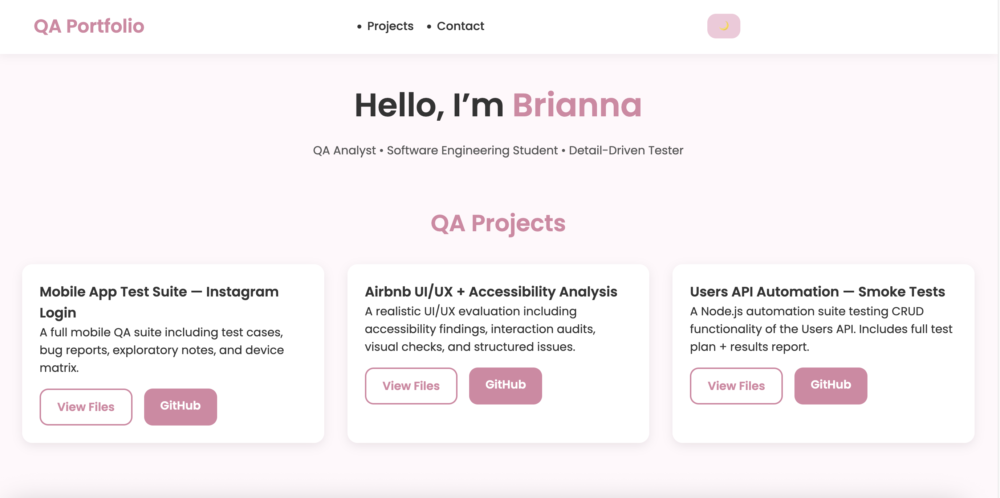

# QA Portfolio

This repository showcases QA skills I developed through software engineering coursework, self-guided practice, and hands-on project testing. It focuses on test case design, defect documentation, API testing, and clear communication for developer-friendly issue reporting.

---

## Screenshot

## 🔍 What This Portfolio Shows

- My ability to write clear test cases
- Identifying and documenting defects using a Jira-inspired format
- API testing experience (GET, POST, PUT, PATCH, DELETE)
- Strong attention to detail and user workflow understanding
- Professional communication through well-structured documentation

## Why This Project Matters

QA is part of how I approach software development. I like understanding what a system is supposed to do, testing the important workflows, documenting what broke, and explaining the issue clearly enough that a developer can reproduce it. This portfolio supports my broader software engineering work by showing validation, communication, and root cause thinking.

---

## 🛠️ Tools & Skills Demonstrated

- Jira-style bug tracking
- Postman + REST API testing
- Swagger
- Functional, regression, smoke testing
- Test case design
- Git/GitHub version control
- Writing concise, developer-friendly documentation

## Portfolio Summary

This QA portfolio demonstrates test planning, bug reporting, API validation, regression thinking, and the kind of careful documentation that supports both software engineering and cyber/IT operations work.

---

## 📬 Contact

**Email:** briannab1997@gmail.com  
**LinkedIn:** https://www.linkedin.com/in/brianna-brockington

Thank you for reviewing my work!
